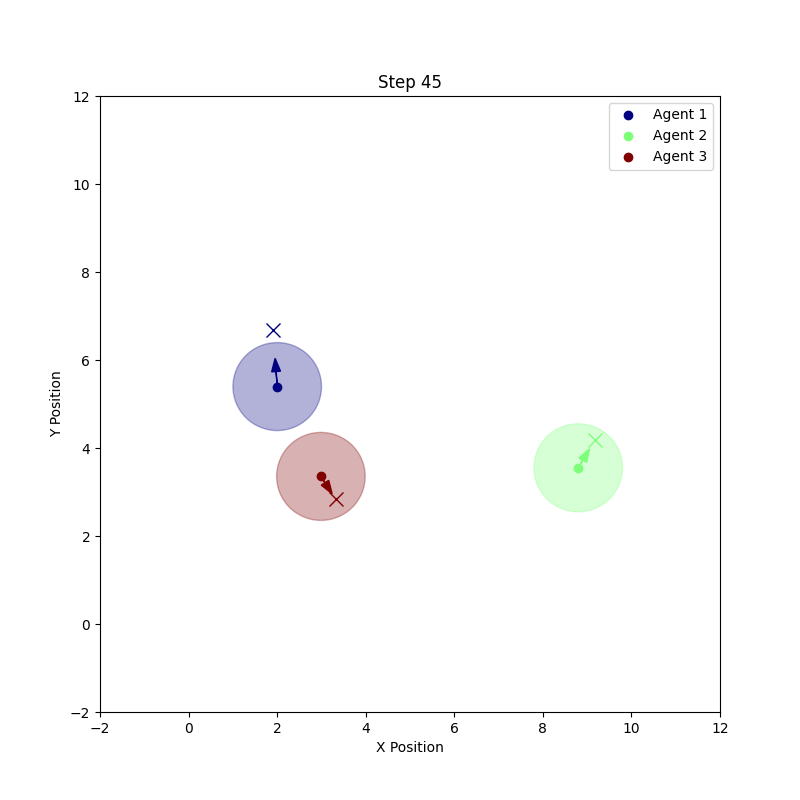

# Python Simulator for Control Barrier function verification.

 The repo is for validating Control barrier function algorithms on Double integrator kinematics robots.

### Media

Here are some images from the `media` folder to help you visualize the simulation:

#### Simulation Example



### Scripts & Functionalities

1. cbf.py - Contains the baseline Centralized Control Barrier Fucntion Optimization solution class
2. softmin_cbf.py - Contains the softmin Centralized Control Barrier Fucntion Optimization solution class
3. simulator.py - Contains the Double integrator Kinematics simulator class (contains nominal PID controller)
4. main.py - Main function to run a config of Optimzation and simulator
5. configs - Contains the start and goal postions of agents, named as swarm_{i}.json where i is the swarm size


### Run Instructions

To run the simulation using `main.py`, use the following command:

```bash
python main.py --optimizer <optimizer_type> --num_agents <number_of_agents> --spawn <spawn_type>
```

- `<optimizer_type>`: Type of optimizer to use. Options are `centralized` or `softmin`.
- `<number_of_agents>`: Number of agents in the simulation.
- `<spawn_type>`: Type of spawn configuration. Options are `circle`, `random`, or `custom`.

#### Example

To run the simulation with a centralized optimizer, 5 agents, and a random spawn configuration:

```bash
python main.py --optimizer centralized --num_agents 5 --spawn random
```
